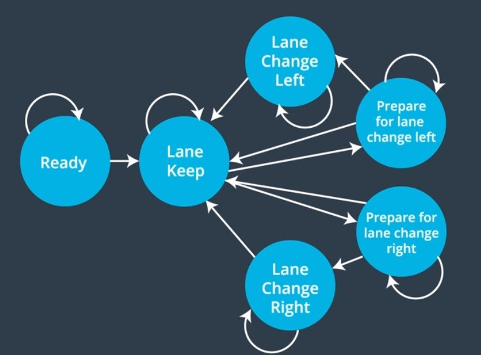
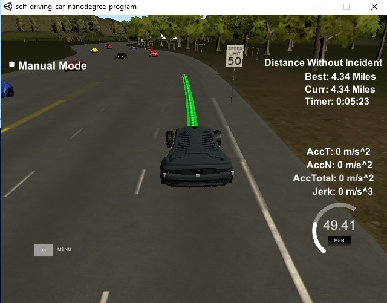
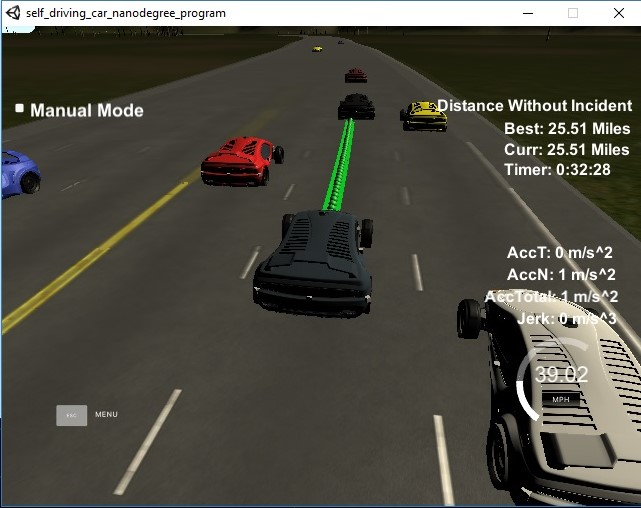

# CarND-Path-Planning-Project
Self-Driving Car Engineer Nanodegree Program
   

## 1: Introduction

This is so far the best project in Self-Driving Car Engineer Nanodegree Program. The goal of the project is to safely drive a car(ego) in a highway situation without any collision with other vehicle and without breaking the traffic constraints. The total track is around 6945.554 m and the speed limit is set to 50 MPH. Other cars are driving +/-10 MPH of the 50 MPH limit. The details of other cars are provided by sensor fusion module. There are some more constraints like, maximum acceleration and maximum jerk should not increase beyond 10m/s^2 and 10m/s^3 respectively. The 'ego' car should always stay inside lanes except when it is trying to change lane.

## 2: Dependencies

* cmake >= 3.5
  * All OSes: [click here for installation instructions](https://cmake.org/install/)
* make >= 4.1
  * Linux: make is installed by default on most Linux distros
  * Mac: [install Xcode command line tools to get make](https://developer.apple.com/xcode/features/)
  * Windows: [Click here for installation instructions](http://gnuwin32.sourceforge.net/packages/make.htm)
* gcc/g++ >= 5.4
  * Linux: gcc / g++ is installed by default on most Linux distros
  * Mac: same deal as make - [install Xcode command line tools]((https://developer.apple.com/xcode/features/)
  * Windows: recommend using [MinGW](http://www.mingw.org/)
* [uWebSockets](https://github.com/uWebSockets/uWebSockets)
  * Run either `install-mac.sh` or `install-ubuntu.sh`.
  * If you install from source, checkout to commit `e94b6e1`, i.e.
    ```
    git clone https://github.com/uWebSockets/uWebSockets 
    cd uWebSockets
    git checkout e94b6e1
    ```
    
### 2.1: Simulator.
The Simulator which contains the Path Planning Project can be downloaded from [here](https://github.com/udacity/self-driving-car-sim/releases/tag/T3_v1.2).


## 3: Input to the Planner

### 3.1: Map of the highway
The map data of the highway is in given in a [csv file](./data/highway_map.csv). It contains a list of waypoints along the track. Each waypoint in the list contains [x,y,s,dx,dy] values. x and y are the waypoint's map coordinate position, the s value is the distance along the road to get to that waypoint in meters, the dx and dy values define the unit normal vector pointing outward of the highway loop.

The highway's waypoints loop around so the frenet s value, distance along the road, goes from 0 to 6945.554.

### 3.2: Data from simulator

Here is the data provided from the Simulator to the C++ Program

#### 3.2.2: Main car's localization Data (No Noise)

    ["x"] The car's x position in map coordinates
    ["y"] The car's y position in map coordinates
    ["s"] The car's s position in frenet coordinates
    ["d"] The car's d position in frenet coordinates
    ["yaw"] The car's yaw angle in the map
    ["speed"] The car's speed in MPH

#### 3.2.3: Previous path data given to the Planner

    ["previous_path_x"] The previous list of x points previously given to the simulator that is not yet executed
    ["previous_path_y"] The previous list of y points previously given to the simulator that is not yet executed

#### 3.2.4: Previous path's end s and d values 

    ["end_path_s"] The previous list's last point's frenet s value
    ["end_path_d"] The previous list's last point's frenet d value

#### 3.2.5: Sensor Fusion Data, a list of all other car's attributes on the same side of the road. (No Noise)

    ["sensor_fusion"] A 2d vector of cars and then that car's [car's unique ID, car's x position in map coordinates, car's y position in map coordinates, car's x velocity in m/s, car's y velocity in m/s, car's s position in frenet coordinates, car's d position in frenet coordinates. 


## 4: Model documentation


### 4.1: Assumptions
  The car uses a perfect controller and will visit every (x,y) point it recieves in the list every .02 seconds. The units for the (x,y) points are in meters and the spacing of the points determines the speed of the car. The vector going from a point to the next point in the list dictates the angle of the car. Acceleration both in the tangential and normal directions is measured along with the jerk, the rate of change of total Acceleration. 

### 4.2: Details

#### 4.2.1: Charateristics of planner
  The planner has following characteristics that it tries to honor:
  
        -> Max speed is set to 49.5 mph just below speed_limit
        -> Center lane is given a higher weightage. The car will try to stay in center lane.
        -> Planner allows a lane change only if it has at least 15m gap both in forward and backward direction in 
        target lane
        -> Planner tries to keep a safe distance around 30m from the leading vehicle
  
  It has the following drwabacks which I plan to improve later:
        
        -> The planner doesn't look beyond one lane for possible lane shift
        -> As it doesn't look into third lane so it doesn't slow down to next slower lane to get to the next-to-next 
        faster lane
    
#### 4.2.2: Generate Predictions from Sensor Fusion Data
   The sensor fusion data received from the simulator in each iteration is parsed and simple trajectories for each of the other cars on the road are generated assuming constant speed and keep lane state. These trajectories match the duration interval of the ego car's previous trajectory end time step. These trajectories are used in conjunction with a set of cost functions to determine a best trajectory for the ego car. Lane change of other cars are handled through a different cost function.

#### 4.2.3: Determine Best State
   The planner uses the following finite state machine to decide next best state.
   


1. Using the finite state machine the planner determines next set of possible states. Refer to `Planner::successor_states` in  [planner.cpp](./src/planner.cpp#426)

2. For each possible state it determines whether changing to that state is feasible. If feasible then it determines the future possible velocity in that state. It also figures out immediate target velocity in that state. For example, suppose ego car is trying to change lane to left but there is vehicle just behind it in the left lane then it is not feasible. Refer `Planner::get_prep_lane_change_state` in [planner.cpp](./src/planner.cpp#L511)

3. Each possible state is evaluated according to a set of cost functions, and the state with the lowest cost is selected.
    - Distance cost: Cost based on both current and projected location of 'ego' car and other cars. This cost increases exponentially as chance of collision increases. -> [`Planner::get_buffer_distance_cost`](./src/planner.cpp#L157)
    - Efficiency cost: Returns cost based on possible velocity of next state. The faster the possible velocity the lower is the cost. -> [`Planner::get_efficiency_cost`](./src/planner.cpp#L209)
    - Lane change extra cost: Assotiate additional cost to lane change to prevent un-necessary lane shift. Reward if the car is trying to shift to center lane when there is no vehicle ahead. -> [`Planner::get_lane_change_extra_cost`](./src/planner.cpp#L216)
    - Reward lane change state if the car is already in that state and not reached center of the target lane. ->  [`Planner::get_target_d_cost`](./src/planner.cpp#L284)

The key steps of best state selection is present in `Planner::choose_next_state` in [planner.cpp](./src/planner.cpp#L298), It also determines how quickly the simulator will react to the new path by adjusting number of points to be taken from previous path. This is done when planner sees a vehicle in close proximity to avoid collision.


#### 4.2.4: Produce New Path
Once the best state is identified from the planner then the details are fed to tajectory generator to create a trajectory for the vehicle. This is done in `Trajectory::create_trajectory` in [tarjectory.cpp](./src/trajectory.cpp#L14). The trajectory generator uses the best state details, previous path from simulator and map waypoints to create the new trajectory. I have used a spline to create it. The spline is implement in [spline.h](./src/spline.h)

## 5. Results
The planner is not perfect but it is able to drive the track in roughly five and half minutes. The following picture shows ego completing the track in 5m 23s.



The car is able to drive without collision for long. The following picture shows it has drove 25.51 miles without a single issue.



It still encounter occasional collision but as of now all such collisions are due to simulator bug which I will explain next.

## 6. Debugging
Debugging is key in any software developement. I have faced several issues debugging this setup with the simulator. 

   1. During the course lessons we were taught how important regression testing is. You fix something but you break some old case. There is no way to do that here other than just hoping old scenarios will randomly occur and get covered.
   As a suggestion, I would say the simulator should have a mode by which we can create certain scenarios and test that.
    
   2. Secondly, I am not sure whether the simulator issues some trigger when a collision happens. I missed that feature. I tried to figure out collsion by 's' data of nearby cars but it failed many times because of simulator bug. Refer to [planner.cpp](./src/planner.cpp#L83).  

## 7. Simulator issues
The final thing I want to mention, which wasted lot of my time, is a buggy behavior of the simulator. Quite often it returns some of the other car's both 's' and 'd' data as 0 whereas in the picture you could see a car. So, the planner would not see that car and may take wrong move and collide. I have printed a log whenever such case happens. It helps debugging.

-----------------------------------
        Time: 331.228 seconds
        My_car: Vehicle:= id: -1 s: 6760.01 d: 10.3538 v: 49.3567 project_s: 6775.43
        Current State: KL Lane: 2 d: 10 Velocity: target 49.5 possible 49.5
                Ahead Vehicle:= id: 9 s: 6914.89 d: 9.81081 v: 40.5907 project_s: 6927.57
                Behind Vehicle:= id: 11 s: 6661.33 d: 10.1752 v: 47.0244 project_s: 6676.03
        State: KL Lane: 2 d: 10 Velocity: target 49.5 possible 49.5
                Ahead Vehicle:= id: 9 s: 6915.94 d: 9.97539 v: 40.5587 project_s: 6928.62
                Behind Vehicle:= id: 11 s: 6664.27 d: 10.1504 v: 47.023 project_s: 6678.96
                         Ahead: v_id: 9 s_diff: actual 155.933
                         Ahead: v_id: 9 s_diff: projected after previous_path end 153.182
                 cost: 0
        State: ST Lane: 0 d: -1 Velocity: target -1 possible 0
                Selected : Velocity: 49.5 D: 10
        SIMULATOR BUG - GARBAGE VEHICLE DATA
        Vehicle:= id: 3 s: 0 d: 0 v: 40.5695 project_s: 0
-----------------------------------

Currently, if a collision happens I first try to check if a 'SIMULATOR BUG' is present in the logs around that time stamp.


